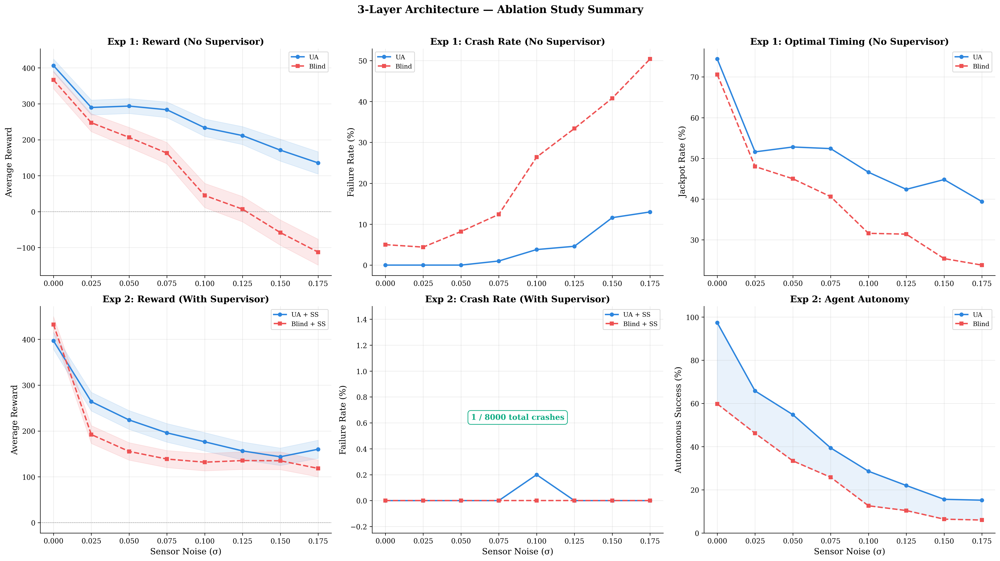

# Uncertainty-Aware Reinforcement Learning for Predictive Maintenance

> Final-year project on predictive maintenance for turbofan engines using LSTM deep ensembles, a DQN maintenance policy, and a deterministic safety supervisor.


## Project Summary

This repository contains my BSc final-year project at the University of Greenwich. The project studies a focused question:

Can a maintenance policy make better decisions under sensor degradation if it can see when its own prediction is unreliable?

To answer that, the system combines three layers:

1. `Layer 1 - Prediction`: a five-model LSTM ensemble predicts remaining useful life (RUL).
2. `Layer 2 - Decision`: a DQN agent decides whether to `WAIT` or `MAINTAIN`.
3. `Layer 3 - Safety`: a deterministic supervisor can override unsafe low-RUL decisions.

The key idea is that maintenance decisions should depend not only on the predicted RUL, but also on how trustworthy that prediction is.



## System Overview

The full pipeline operates as follows:

- raw C-MAPSS sensor windows are normalised and passed to a five-member LSTM ensemble
- the ensemble outputs a mean RUL prediction and a disagreement-based uncertainty signal
- the RL agent observes `[mu_RUL, sigma_now, sigma_rolling, sensor_health]`
- the agent chooses `WAIT` or `MAINTAIN`
- the safety supervisor can intervene in critical low-RUL conditions

This gives a clean separation between prediction, control, and safety logic.

## Main Findings

Two results matter most.

First, in the no-supervisor comparison, the uncertainty-aware agent stayed positive at every tested noise level, while the blind baseline collapsed into negative reward under heavy noise.

Second, in the full three-layer system, both agents were kept near zero failure, but the uncertainty-aware agent was substantially more autonomous and far less dependent on supervisor intervention.

### Clean-data headline numbers

| Metric | Uncertainty-Aware | Blind Baseline |
|---|---:|---:|
| Mean reward (full system) | 396.6 | 432.1 |
| Supervisor overrides | 13 | 201 |
| Autonomy | 97.4% | 59.8% |
| Autonomous jackpots | 353 / 500 | 214 / 500 |

### Other headline numbers

- Heaviest tested noise level (`sigma = 0.175`): UA `135.6`, Blind `-112.8`
- Average annual saving: `GBP 556,950` for a representative 50-engine fleet
- Uncertainty calibration: `PICP 0.61` at nominal `0.95`, so sigma is treated as a relative reliability signal rather than a calibrated probability

## Dataset

The project uses NASA C-MAPSS FD001 and FD002.

| Subset | Engines | Rows |
|---|---:|---:|
| FD001 | 100 | 20,631 |
| FD002 | 260 | 53,759 |
| Combined | 360 | 74,390 |

After 30-cycle windowing, the combined dataset yields `63,590` training windows.

Preprocessing choices:

- 24 input features per cycle (`21` sensors + `3` operating settings)
- MinMax scaling
- RUL cap of `125`
- sliding window length of `30`

## Experimental Setup

The main evaluation is a controlled ablation study:

- two agent types: uncertainty-aware and blind
- eight noise levels
- `500` episodes per condition
- two primary experiments: without supervisor and with supervisor
- Welch's t-test and Cohen's d for statistical comparison

This design isolates whether the uncertainty signal helps the policy itself, rather than letting the safety layer hide a weak controller.

## Repository Guide

The most important files are:

| Path | Purpose |
|---|---|
| [`dashboard.py`](dashboard.py) | Streamlit interface for the live demo |
| [`main_train_ensemble.py`](main_train_ensemble.py) | trains the five-model LSTM ensemble |
| [`main_train_rl.py`](main_train_rl.py) | trains the DQN maintenance policy |
| [`main_experiment_final.py`](main_experiment_final.py) | runs the main ablation experiments |
| [`main_experiment_ppo.py`](main_experiment_ppo.py) | supplementary PPO vs DQN comparison |
| [`main_cost_analysis.py`](main_cost_analysis.py) | fleet-level financial analysis |
| [`generate_charts.py`](generate_charts.py) | regenerates key report charts |
| [`test_system.py`](test_system.py) | automated `pytest` suite |
| [`main.tex`](main.tex) | dissertation source |
| [`main.pdf`](main.pdf) | dissertation PDF |

Core package modules:

```text
src/
  config.py
  preprocessing.py
  lstm_model.py
  gym_env.py
```

## Setup

Create a virtual environment and install dependencies:

```bash
python -m venv .venv

# Windows PowerShell
.venv\Scripts\Activate.ps1

pip install -r requirements.txt
```

## Quick Start

Run the test suite:

```bash
pytest test_system.py -v
```

Launch the dashboard:

```bash
streamlit run dashboard.py
```

The dashboard is the fastest way to inspect the full system end to end.

## Reproducing the Main Pipeline

Train the ensemble:

```bash
python main_train_ensemble.py
```

Train the DQN policy:

```bash
python main_train_rl.py
```

Run the main experiments:

```bash
python main_experiment_final.py
python main_experiment_ppo.py
python main_cost_analysis.py
```

Regenerate figures:

```bash
python main_evaluate_ensemble.py
python main_visualize.py
python generate_charts.py
```

## Demo Sequence

For presentation or viva use, the cleanest sequence is:

1. `Engine 134`, no extra noise
2. `Engine 200`, moderate noise
3. side-by-side uncertainty-aware vs blind comparison
4. one safety-intervention case

That sequence makes it easy to explain the three layers without overloading the discussion.

## Testing

The repository includes a `29`-test `pytest` suite covering:

- data loading and preprocessing
- LSTM model loading and ensemble diversity
- Gymnasium environment behaviour
- reward classification
- safety supervisor logic
- end-to-end integration behaviour

## Dissertation

The dissertation is included in the repository:

- PDF: [`main.pdf`](main.pdf)
- Source: [`main.tex`](main.tex)

## Limitations

This is a research prototype, not a deployment-ready aerospace product.

Important limitations stated in the report:

- validation is on simulated C-MAPSS data rather than live operator data
- the uncertainty estimates are not fully calibrated
- the action space is intentionally binary
- DQN is the primary RL algorithm, with PPO included as a supplementary comparison
- real deployment would require certification, explainability work, and operational validation

## Author

Abhishek Soni  
BSc Final Year Project  
University of Greenwich
